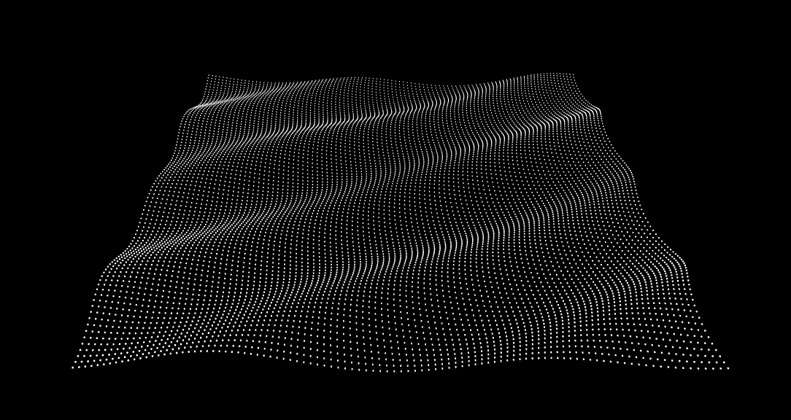

# Gerstner Wave Simulation



## API

### Wave

```wave = new Wave( scaling, direction, speed, height, lambda )```
* scaling : THREE.Vector3. This defines the size of the field to emulate the wave in.
* direction : THREE.Vector3. Sets the direction of propgation of the wave.
* speed : float. Propagation speed.
* height : float. Height of the wave.
* lambda : float. Wavelenght relative to the scaling.

#### Properties

* ```.scaling : THREE.Vector3``` defines the size of the field.
* ```.direction : THREE.Vector3```. Propgation direction of the wave.

#### Methods

* ```.getParticle( particle )```
* ```.update()```

### MultipleWaves

```sea = new MultipleWaves( scaling )```
* scaling : THREE.Vector3. This defines the size of the field to emulate the wave in.

#### Properties

* ```.scaling : THREE.Vector3``` defines the size of the field.

#### Methods

* ```.example()```
* ```.addWave( direction, height, speed, lambda )```
* ```.getParticle( particle )```
* ```.update()```

## Related

* [Trochoidal wave](https://en.wikipedia.org/wiki/Trochoidal_wave) on Wikipedia.org
